# Windows Machine Nvidia CUDA, CUDNN, Tensorflow setup and configuration guide

## Some complains

After trying install tensorflow by myself with reading the official [tensorflow guide](https://www.tensorflow.org/install/gpu) and confusing [Nvidia CUDNN install manual](https://docs.nvidia.com/deeplearning/cudnn/install-guide/index.html#install-zlib-windows), I completely mess up with my local machine.

Although it seems like you could install tensorflow normally and run it without any complains but warning messages show up, which is absolutely annoying. But once I try to run a basic neural network and it just blow up my jupyter kernel in anyway. And after doing so many researches and watching so many Youtube videos which uploaded from years ago, I still cannot fix the problem, until I found [this one](https://www.youtube.com/watch?v=OEFKlRSd8Ic). This video from Jeff Heaton explain things with details that how to install all dependencies but I think some parts are still not crystal clear, so I decide to write this guide to help people to config their machine to run tensorflow with Nvidia GPU support in the right way!

## Before everything starts

You need to make sure that:

- you are running a **window 10 or above system**, since this is a tutorial for windows
- your machine has a **Nvidia GPU** which has **Cuda** support, you could check via the official page

## Steps

### Download Nvidia GPU driver

You need to download a Nvidia GPU driver to enable some GPU functions, for now I suggest you download the latest one, you could go to [this website](https://www.nvidia.com/download/index.aspx).

Once you access this website, you need to choose your GPU product type, product Series and other information, here I will download a driver for my GTX1080 ti.

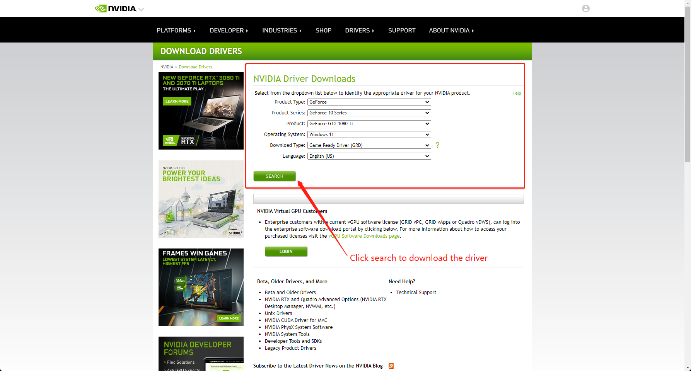

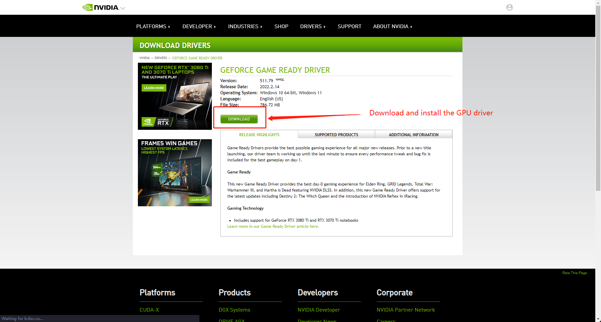

After download, simply install it with default settings and you could move to the next step.

_Your Computer may reboot or there might be some flicks on your screen_.

### Download Nvidia CudaToolKit

You need to go to **Nvidia Developer Page** to download Cuda ToolKit, you could find the latest Cuda ToolKit at here: https://developer.nvidia.com/cuda-downloads.

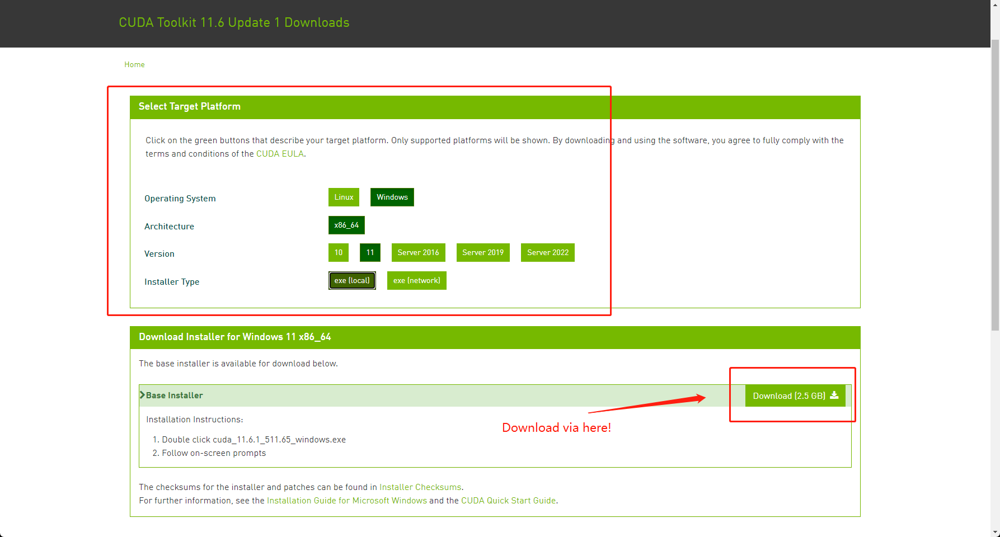

For my personal test, I found the version 11.2 is the most stable one., you could download it via this link: https://developer.nvidia.com/cuda-11.2.2-download-archive?target_os=Windows&target_arch=x86_64&target_version=10&target_type=exelocal.

**Cuda version is very important! Please make sure you are download version 11.X to compatible with tensorflow version 2.7 or above!**

### Download Nvidia cuDNN

Before download cuDNN, you have to register a nvidia developer account otherwise you don't have further access. After login you account, you need to go to this website: https://developer.nvidia.com/rdp/cudnn-archive to download the right cuDNN library!

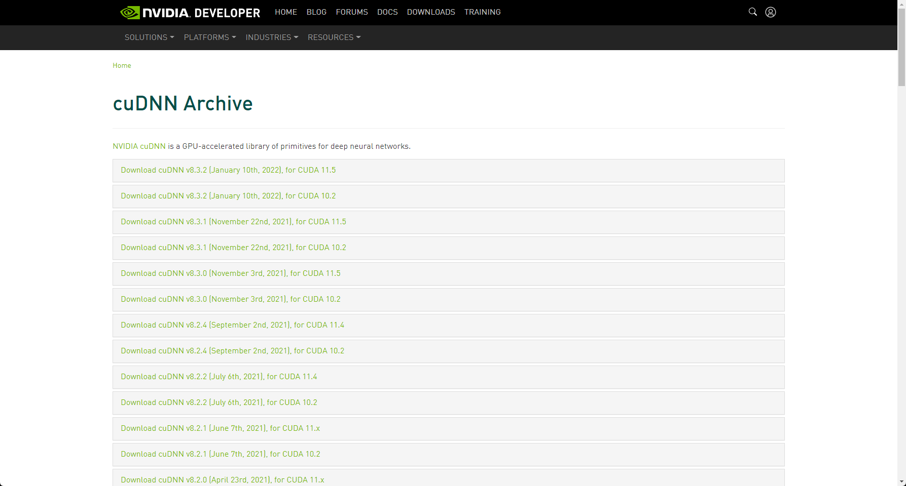

Because I download the Cuda Toolkit version 11.2, I will download cuDNN v8.1.1 to match Cuda version, you need to download compatible cuDNN library, please read download title carefully! Here is an example of my download selection:

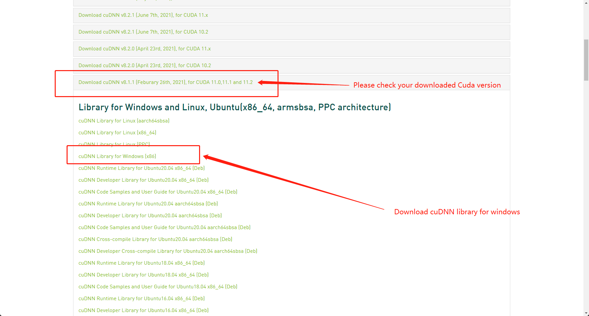

Unlike Cuda Toolkit, you will obtain an zip file contains all critical header files and scripts. I will create a folder called tools under `C:\` directory, after that I will unzip the downloaded cuDNN.zip file and put the entire folder under `C:\tools`. As a result, you should have a directory like this: `C:\tools\cudnn-11.2-windows-x64-v8.1.1.33`.

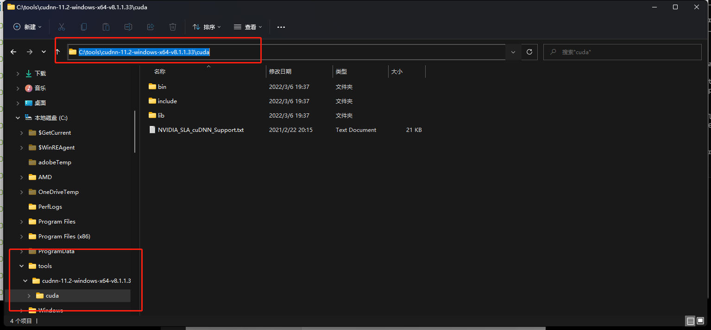

### Final STEP!

The last step is config the windows environment variables follow [Tensorflow setup guide](https://www.tensorflow.org/install/gpu), you need to config the following items:

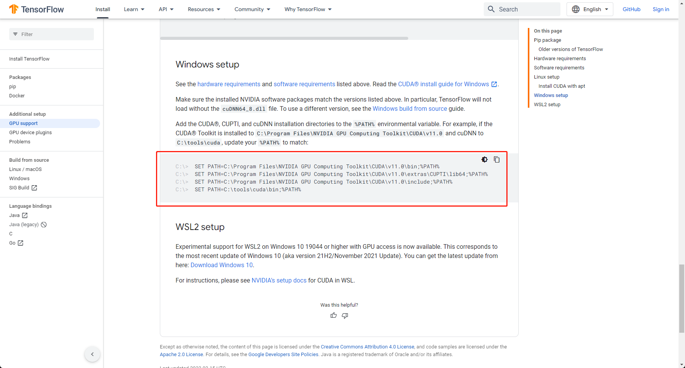

You need to open the environment setup panel, and config the **path** variable, I suggest you edit **path** variable in both user variable and environment variable.

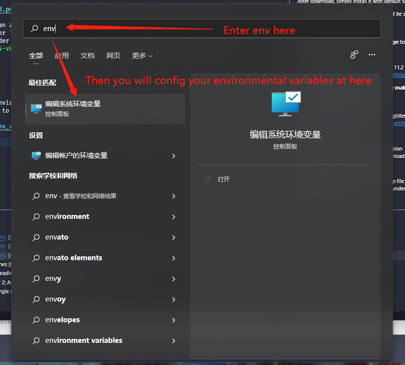

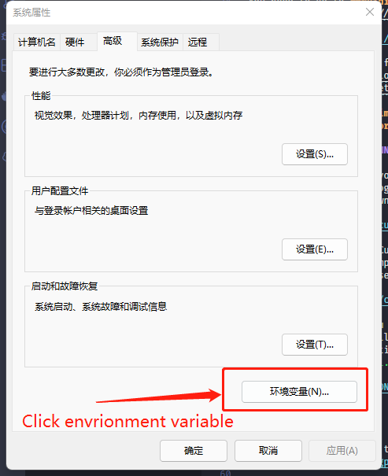

This is the pop up window you should have.

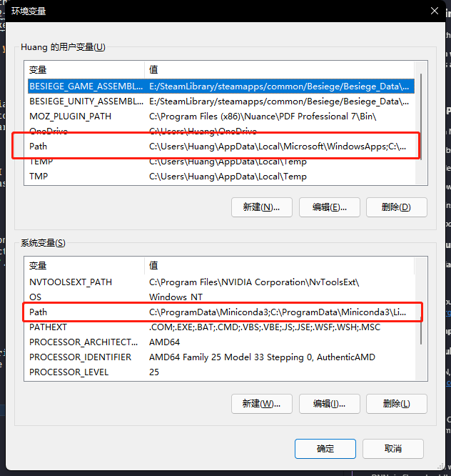

Double click to edit the path variable.

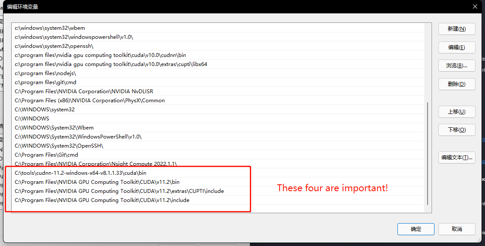

Click add button on the top right corner to add your cuda paths!

```plantText
# if you download the same package as I do, then the following path should be the same.

C:\tools\cudnn-11.2-windows-x64-v8.1.1.33\cuda\bin
C:\Program Files\NVIDIA GPU Computing Toolkit\CUDA\v11.2\bin
C:\Program Files\NVIDIA GPU Computing Toolkit\CUDA\v11.2\extras\CUPTI\include
C:\Program Files\NVIDIA GPU Computing Toolkit\CUDA\v11.2\include

```

This configuration is essential and to make sure that tensorflow could use your GPU to perform any GPU calculation.

### Other installations

On windows, the easiest way to setup tensorflow is via anaconda or miniconda. But I think anaconda is to complex although is beginner friendly, so I download miniconda instead. You could download the latest miniconda via this webpage: https://docs.conda.io/en/latest/miniconda.html.

After install miniconda, try this command: `nvcc --version` to check your CudaToolKit is installed and version is the same as your selection.

Personally, I prefer using jupyter lab, so use conda to install jupyter, jupyter lab. To run tensorflow, I suggest you install tensorflow via pip. pip will provides you the latest tensorflow version with built-in GPU support.

### CHECK

If everything is run correctly, you could run the following code to check Cuda is enabled:

```python
import tensorflow as tf
print(len(tf.config.list_physical_devices('GPU')) > 0) # if True then you install everything correctly
print("GPU is", "available" if tf.test.is_gpu_available() else "NOT AVAILABLE") # double check
```

## Final Words

This thing is too complicating and annoying, I hope there will be a better tutorial to help programmers, data science to install all dependencies more efficiently. Because running locally is more trusty and easy to monitor the progress.

I believe nobody would like to spends tons of time to do big project on Colab and keep Colab session not expired for hours, days, even month!
